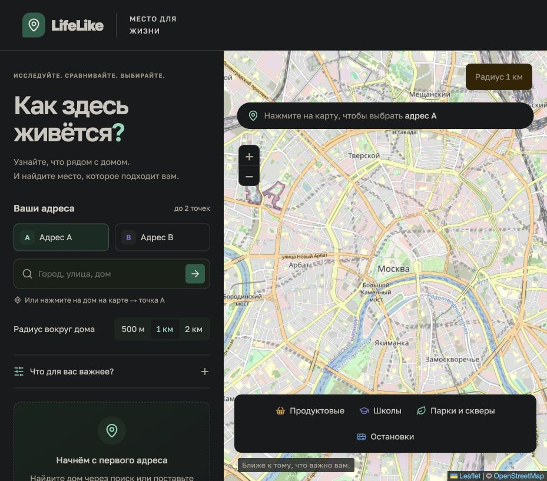
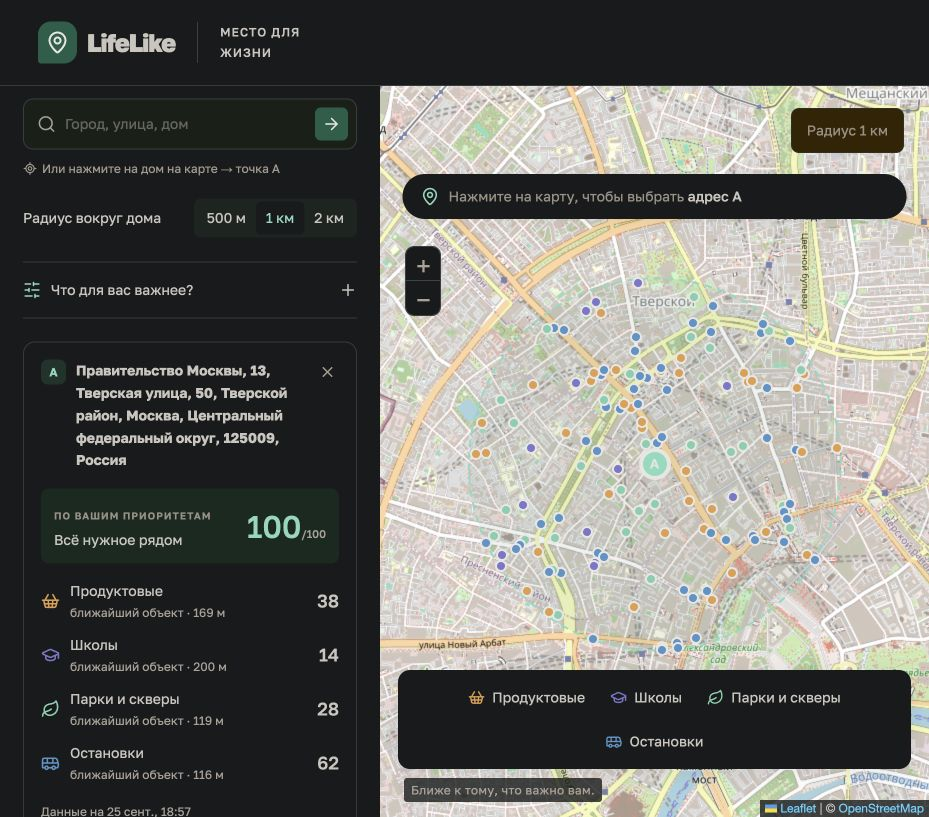

# LifeLike — «Как здесь живётся?»

Что окажется рядом с будущим домом: магазины, школы, аптеки, парк или удобная остановка? **LifeLike** помогает изучить окружение и сравнить два адреса с учётом того, что важно именно вам.

Выберите адрес через поиск или поставьте точку на карте, задайте радиус **500 м, 1 км или 2 км** — приложение найдёт инфраструктуру в OpenStreetMap и покажет расстояния по прямой.

**Онлайн:** [lifelike-gamma.vercel.app](https://lifelike-gamma.vercel.app)

## Скриншоты

### Карта и поиск адресов



### Инфраструктура вокруг адреса



Снимки сделаны в работающем приложении с реальной картой и данными OpenStreetMap. Количество объектов зависит от выбранной точки, радиуса и актуальности данных.

## Возможности

- **Поиск адресов** через Nominatim по кнопке или Enter, без автозапросов при вводе.
- **Выбор на карте** — две независимые точки A и B.
- **Инфраструктура рядом** — продуктовые магазины, школы, парки и скверы, остановки и станции, аптеки, поликлиники, детские сады, спортивные площадки и пункты выдачи (включая постаматы).
- **Сравнение двух адресов** — количество объектов по категориям и оценка по вашим приоритетам.
- **Личные приоритеты** от 0 до 5: изменение весов пересчитывает оценку без повторного запроса.
- **Подробности объектов** — раскрывающийся список в карточке каждого адреса, фильтр по категории, сортировка по расстоянию или названию, адрес и часы работы из OSM. Кнопка «Показать на карте» открывает карточку объекта на карте.
- **Внешний пеший маршрут** — ссылка в Google Maps от адреса A или B до объекта; расчёт времени внутри приложения пока не выполняется.
- **Светлая и тёмная карта** — отдельный переключатель на карте; выбор сохраняется в браузере. Тёмный режим меняет цветовую обработку стандартных тайлов OSM, не затрагивая интерфейс и маркеры и не требуя нового поставщика карт.
- **Фильтры карты** и расстояние до ближайшего объекта каждой категории.
- **Серверный кеш**, обработка ошибок и повторная загрузка.

## Стек

| Задача                         | Технологии                                     |
| ------------------------------ | ---------------------------------------------- |
| Интерфейс и серверные маршруты | TypeScript, React 19, Next.js 16 / App Router  |
| Интерактивная карта            | Leaflet, React Leaflet                         |
| Поиск адресов                  | Nominatim                                      |
| Инфраструктура                 | Overpass API, OpenStreetMap                    |
| Иконки                         | Lucide React                                   |
| Проверки и форматирование      | Node.js Test Runner, tsx, TypeScript, Prettier |

## Быстрый запуск

Требуются **Node.js 20.9+**, npm и доступ к интернету для загрузки карты и данных.

```sh
npm ci
cp .env.example .env.local
npm run dev
```

Откройте **[http://127.0.0.1:3010](http://127.0.0.1:3010)**. Оставьте терминал с сервером запущенным; остановка — `Ctrl+C`.

Порт `3010` выделен для LifeLike, чтобы не конфликтовать с другими проектами на `3000`. Используйте `127.0.0.1`: имя `localhost` может разрешаться в IPv6 и вести к другому локальному серверу.

Для запуска production-сборки остановите сервер разработки и выполните:

```sh
npm run build
npm start
```

Адрес остаётся тем же: `http://127.0.0.1:3010`. Это локальный запуск, а не публикация приложения в интернете.

## Как пользоваться

1. Выберите **«Адрес A»**, введите город, улицу и дом, нажмите стрелку или Enter и выберите результат. Можно просто нажать на карту.
2. Установите радиус и дождитесь загрузки инфраструктуры.
3. Выберите **«Адрес B»** и добавьте вторую точку. Ниже карточек появится таблица сравнения.
4. Откройте **«Что для вас важнее?»** и настройте веса категорий. Ноль исключает категорию из оценки.
5. Нажмите категорию в легенде, чтобы оставить на карте только её объекты. Повторное нажатие вернёт все категории.

## Настройки

Переменные в `.env.local`:

| Переменная       | Назначение                                    |
| ---------------- | --------------------------------------------- |
| `NOMINATIM_URL`  | Базовый адрес сервиса поиска                  |
| `OVERPASS_URL`   | URL обработчика запросов инфраструктуры       |
| `OSM_USER_AGENT` | Идентификатор приложения для внешних сервисов |

Значения по умолчанию приведены в [.env.example](.env.example). После изменения настроек перезапустите сервер.

## Архитектура

`app/api/search` — серверный поиск, кеш на 24 часа, не более одного обращения в 1.1 секунды и одного активного запроса Nominatim на процесс. `app/api/nearby` — серверный Overpass, кеш на час, не более двух активных запросов. Кеш ограничен 300 ключами, объединяет одинаковые одновременные запросы, не кеширует ошибки и неполные ответы Overpass. Внешние запросы имеют таймауты.

`lib/geo.ts` — формула гаверсинуса, классификация OSM, фильтрация радиуса и оценка. `components/map.tsx` загружается только в браузере. Координаты, радиусы и поисковые строки валидируются на сервере.

## Ограничения и методика

Расстояния считаются по прямой. Для парка выбирается ближайший известный вход на внешней границе OSM: узел `entrance` или ворот `barrier`, связанный с контуром парка. Учитываются контуры way и внешние way-члены relation; входы с запрещённым пешим или частным доступом исключаются, кроме явного разрешения для пешеходов. Вход в соседнее здание не считается входом в парк. Если подходящий вход не найден, используется узел или центр геометрии с пометкой о приблизительности. Выбранная точка используется для расстояния, фильтра радиуса, маркера и внешнего маршрута. Внутренние и не связанные с контуром входы, а также парки, которые Overpass не вернул по пространственному запросу, могут быть пропущены. Маршрутизации и времени пешком пока нет. Часы работы показаны в исходной записи OSM (кроме `24/7`, которое отображается как «Круглосуточно»); статус «открыто сейчас» не рассчитывается. Отсутствующие адреса и расписания явно отмечаются. При открытии ссылки маршрута координаты начала и конца передаются Google Maps.

Геометрии не отображаются: только точки и радиусы. Данные OSM могут быть неполными; часть дублей и объектов может оставаться нераспознанной. Записи `bus_stop` и `platform` объединяются при одинаковом нормализованном названии и виде транспорта, расстоянии не более 12 м и отсутствии противоречий в `ref` и `direction`. Безымянные остановки, разные направления и неоднозначные записи не объединяются. Сохраняются идентификаторы источников и ближайшая точка; в карточке показано количество объединённых записей.

Оценка — взвешенное среднее `min(количество / ориентир, 1) × 100`. Ориентиры: 8 магазинов, 3 школы, 3 парка, 10 остановок, 3 аптеки, 2 поликлиники, 3 детских сада, 4 спортплощадки и 4 пункта выдачи. Нулевой вес исключает категорию, все нулевые веса отключают оценку. Это условная доступность объектов по количеству, а не показатель безопасности, качества школ, площади зелени или объективной пригодности района.

Публичные сервисы могут отвечать медленно или ограничивать доступ. Данные не подменяются демонстрационными. «Повторить загрузку» повторяет запрос, но действующий серверный кеш сохраняется. Кеш находится в памяти и сбрасывается при перезапуске. Для нескольких реплик необходимо общее хранилище и распределённое ограничение частоты; для публичного запуска также нужно добавить защиту API от злоупотреблений. Для заметной нагрузки используйте собственные или коммерческие сервисы.

В `.env.local` задайте `OSM_USER_AGENT` с реальным контактом владельца приложения перед публичным запуском. `NOMINATIM_URL` и `OVERPASS_URL` позволяют заменить поставщика без изменения исходников. Адреса и координаты передаются соответствующим внешним сервисам; тайлы загружаются браузером напрямую из OSM. Приложение не сохраняет историю адресов.

Правила и источники: [Nominatim](https://operations.osmfoundation.org/policies/nominatim/), [Overpass](https://dev.overpass-api.de/overpass-doc/en/preface/commons.html), [тайлы OSM](https://operations.osmfoundation.org/policies/tiles/), [атрибуция и ODbL](https://www.openstreetmap.org/copyright).

### Заполненность сведений

В каждой карточке адреса показаны доли найденных объектов с названием, адресом и часами работы, число парков с известным входом и количество объединённых дублей остановок. Общий процент — число заполненных полей из этих трёх, делённое на `3 × число объектов`. Для пустого результата процент не рассчитывается.

Это **не полнота покрытия района** и не проверка достоверности: у парка может законно отсутствовать адрес или расписание. Заполненное поле также может быть устаревшим.

Новые категории используют `amenity/healthcare=pharmacy`, `amenity/healthcare=clinic`, `amenity=kindergarten`, `leisure=pitch/fitness_station`, `shop=outpost`, `amenity=parcel_locker` и `post_office:parcel_pickup=yes`. Постаматы с `parcel_pickup=no` исключаются. «Поликлиники» включает клиники, отмеченные этими тегами, а не только государственные учреждения; спортплощадки могут иметь ограничения доступа.

## Проверки

```sh
npm run test
npm run typecheck
npm run build
```

Тесты проверяют расстояния, обработку OSM, оценку и кеш. Для ручной проверки выберите два адреса, смените радиус, измените приоритеты, отключите сеть и проверьте сообщение об ошибке. Для проверки лимита поиска отправьте разные запросы подряд.

## Публикация на Vercel

Интерфейс и API размещены в одном Next.js-проекте. Для серверных маршрутов задан лимит выполнения 60 секунд, чтобы запрос Overpass успевал завершиться или вернуть контролируемую ошибку.

Повторная публикация из корня проекта:

```sh
npx vercel login
npx vercel --prod
```

Локальная привязка `.vercel/` исключена из Git. Автоматический деплой из GitHub пока не подключён: сначала нужно связать GitHub-аккаунт с Vercel и подключить репозиторий в настройках проекта.

Кеш и ограничения частоты сейчас действуют внутри отдельного экземпляра серверной функции. При холодном старте кеш пуст; между экземплярами он не разделяется. Для масштабирования потребуется общее хранилище кеша и распределённый лимитер запросов к публичным API.

### Временные сбои Overpass

При сетевой ошибке, таймауте, ошибочном HTTP-ответе или неполных данных сервер последовательно пробует резервный Overpass. По умолчанию это `overpass.private.coffee`; для своего основного провайдера резерв нужно явно указать в `OVERPASS_FALLBACK_URL`. Пустое значение отключает резерв. На один запрос выполняется не больше двух попыток по 28 секунд. Недоступный сервер пропускается в течение минуты. Ошибка синтаксиса запроса (HTTP 400) не повторяется на другом сервере.

Если оба сервера недоступны, API отвечает 503 с `Retry-After: 60` и понятным сообщением. Пустые или частичные данные не подменяют успешный результат и не попадают в кеш. Резервный сервер получает те же координаты и радиус; ограничения запросов и часовой кеш сохраняются.
